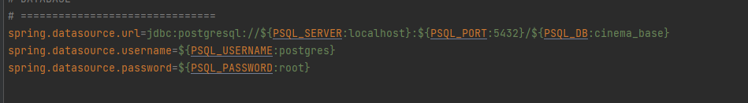
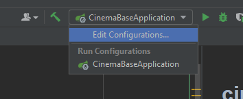
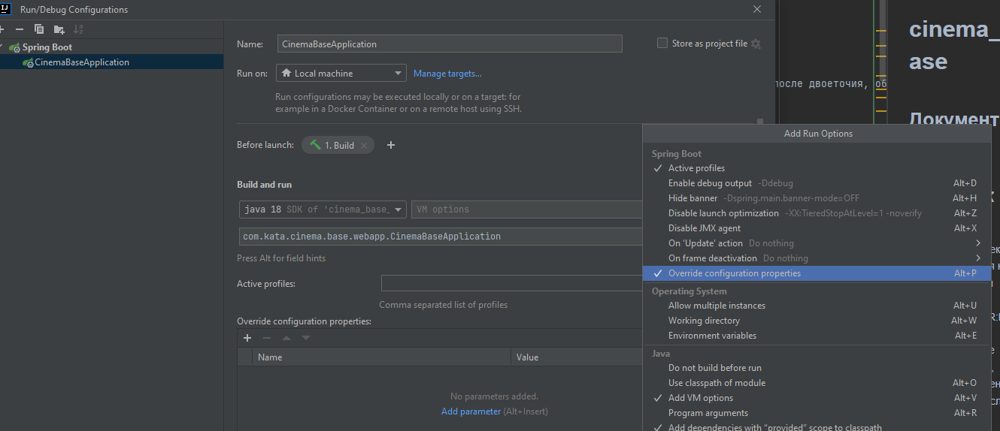
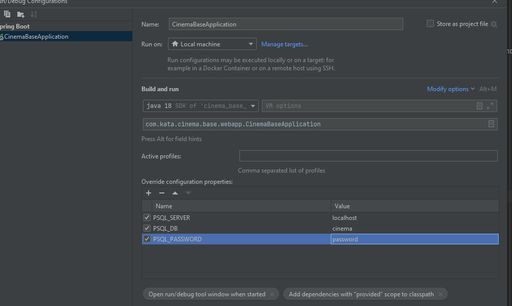
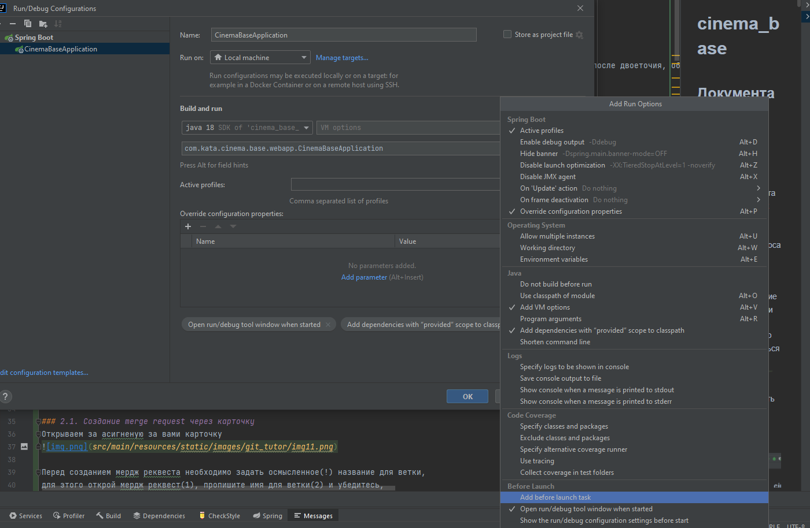
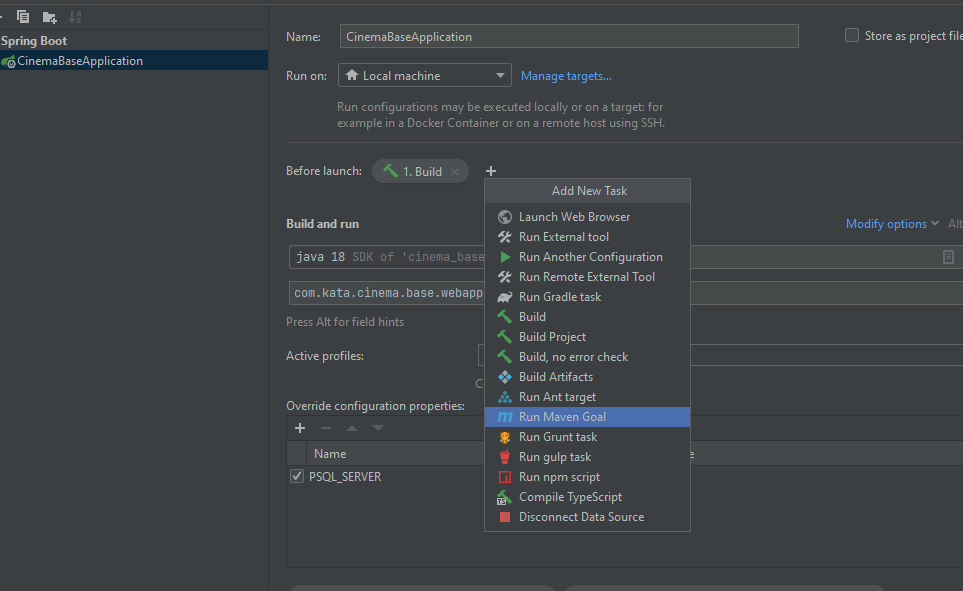
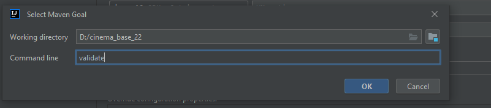
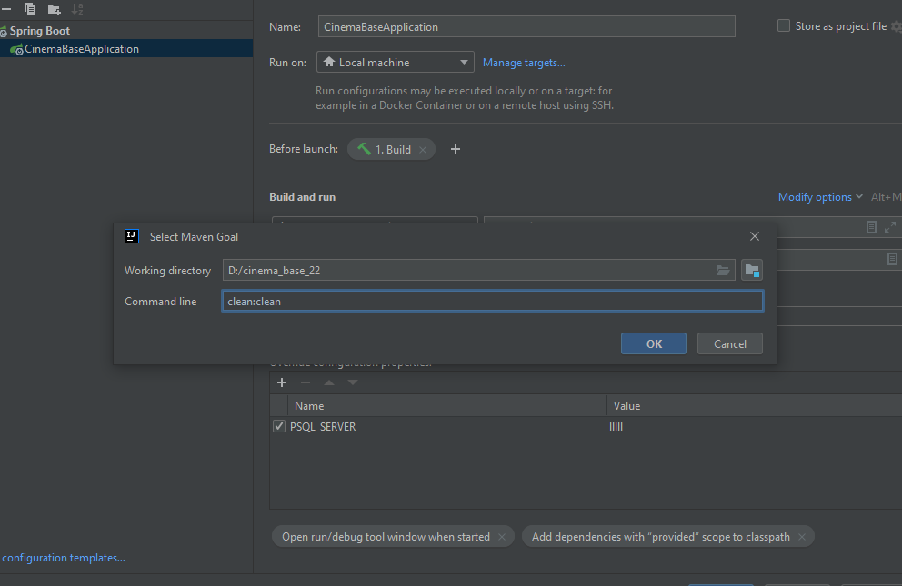
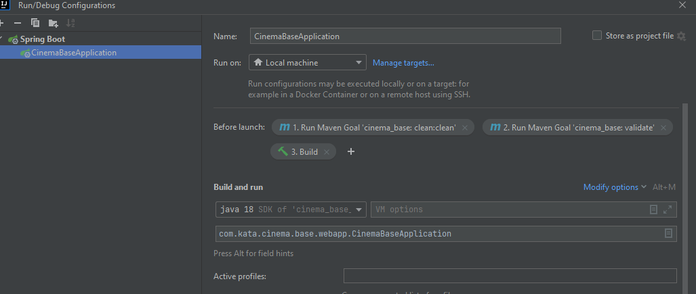

# cinema_base

## Документация

## 1. Запуск проекта

В пропертях проекта для подключения к БД используются параметры типа: ${PSQL_SERVER:localhost}, важно, значение идущее после двоеточия, обозначает значение по умолчанию, если параметр не переопределить, то будет использоваться это значение



Их можно прописать в конфигурации проекта

1 шаг


2 шаг  


3 шаг


в проекте используется checkstyle и мапстракт, для их корректной работы необходимо добавить шаг validate и clean перед билдом

1 шаг


2 шаг добавить add before launch task


3 шаг



4 шаг


5 шаг


6 шаг, проверить порядок!!



## 2. Создание merge request


### 2.1. Создание merge request через карточку
Открываем за асигненую за вами карточку


Перед созданием мердж реквеста необходимо задать осмысленное(!) название для ветки,
для этого открой мердж реквест(1), пропишите имя для ветки(2) и убедитесь,
что новая ветка будет создана от **main** ветки(3) (**в данном проекте вместо dev ветки используется main**)


В мердж реквесте в разделе **Overview**(1) будут отображаться замечания к коду,
свои изменения можно будет посмотреть в разделе **Changes**(2),
созданная ветка и куда она будет мерджиться можно будет посмотреть в блоке (3),
в случае если мердж реквест нужно изменить, это можно сделать в кнопке **Edit**(4),
после выполнения задания обязательно нажимайте кнопку **Mark as ready**(5),
в гитлабе за асигненые за вами карточки можно просмотреть по кнопке справа в виде
карточек(6), а ваши мердж реквесты в кнопке в виде веток(7)


### 2.2. Создание merge request если уже создана ветка
Нажмите на вкладку **Merge request** слева (1), нажмите на кнопку **New merge request** (2)


На открывшейся странице выберите в сурса свою ветку (1), проверьте, что в ветке куда вы собрались мерджить свои изменения стоит **main** (2)  ,
нажмите кнопку **Compare branches and continue** (3)


На новой странице в селекторе **Assignee** выберите себя (1), в селекторе **Reviewer** выберите проверяющего (2). Проверьте, что стоит чекбокс на удаление после мерджа (3), нажмите кнопку **Create merge request** (4).

### **После создания реквеста приложите ссылку на него в карточку в комментариях**!!!!!!!!!!!!!!


## 3. Актуализация ветки и подготовка ее к пуши
Прежде чем запушить свои изменения, необходимо подготовить ветку к отправке.

Чтобы иметь на руках актуальную версию проекта, необходимо обновить мастер-ветку,
это нужно делать каждый раз перед отправкой задачи на проверку
Для этого нажмите на текущую ветку в правом нижнем углу. Выберите опцию **main | update**.


Чтобы подтянуть все смерженные коммиты в локальную ветку, в которой вы работаете, нужно:


## Инструкция по commit-ам

Предлагаю в принудительном порядке соблюдать стандарт при коммитах, более подробно по стайлгайду
можно ознакомиться по этим статьям и нагуглить дополнительную информацию (важно понимать, что это субъективизм и
на разных проектах могут быть свои правила или их отсутствие)
https://habr.com/ru/company/sberbank/blog/662744/
https://www.conventionalcommits.org/ru/v1.0.0-beta.2/

Далее будет краткое описание правил при написании коммитов, которым мы будем придерживаться в рамках данного проекта


```
<type> [optional область]: <Заголовок краткое описание>
[optional тело] 
[подвал]
```

Есть следующие типы

- fix - исправление багов
- feat - новый функционал
- docs - правки/написание документации
- style - правки код стайла
- test - написание/изменение теста
- refactor - рефактор


В теле описания должны быть ответы на вопросы: «Что?» и «Почему?», если делать это не целесообразно(много кода), можно в крации описать, как было до и как стало после
В подвале мы указываем номер задачи так: issue #"Номер задачи"

Желательно избегать смешивание коммитов разных типов, но допускается создание дополнительных заголовков в теле

(в данном случае можно описывать коммиты на русском)


## Описание сущностей
(ссылка на диаграмму - https://dbdiagram.io/d/61f1b1147cf3fc0e7c6dce0e)


### users - `таблица обозначающая аккаунт пользователя в система`
- id - уникальный идентификатор
- email - почта
- first_name - имя
- last_name - фамилия
- password - пароль
- birthday - дата рождения
- enable - доступность пользователя к системе

### users_role - `связующая таблица` для связи ManyToMany

### roles - `определяет права пользователя в системе`
- id - уникальный идентификатор
- name - наименование роли, имеет тип enum


### score - `таблица отвечающая за оценку пользователей на фильм`
- id - уникальный идентификатор
- movie_id - уникальный идентификатор фильма
- user_id - уникальный идентификатор пользователя
- score - оценка

### movies - `таблица отвечающая за фильмы/сериалы`
- id - уникальный идентификатор
- name - наименование
- original_name - оригинальное наименование фильма
- countries - страны производства
- date_release - дата выхода
- rars - возрастная классификация информационной продукции в России
- mpaa - система рейтингов Американской киноассоциации
- time - продолжительность фильма
- desciption - описание фильма
- type - тип сериал/фильм, принимает следующее значение MOVIES, SERIALS

### genres - `таблица отвечающая за жанры фильмов`
- id - уникальный идентификатор
- name - имя жанра


### persons - `знаменитости разной деятельности в кино`
- id - уникальный идентификатор
- first_name - имя
- last_name - фамилия
- height - рост
- date_birth - дата рождения
- place_of_birth место рождения

### cast - `каст фильма`
- movie_id - уникальный идентификатор фильма
- profession_id - уникальный идентификатор професии
- person_id - уникальный идентификатор персоны(реального человека)
- character_id - уникальный идентификатор персонажа фильмы


### characters - `песонажи фильма`
- id - уникальный идентификатор
- person_id - уникальный идентификатор персоны
- name - имя
- age - возраст
- description - описание
- movie_id - уникальный идентификатор фильма
- type_character - тип персонажа в фильме/сериале, может принимать следующие значения MAIN_CHARACTER, MINOR_CHARACTER, NO_CHARACTER_MOVIE


### dubbing_actors - `актеры дубляжа`
- id - уникальный идентификатор
- character_id - уникальный идентификатор озвучиваемого персонажа
- person_id - уникальный идентификатор персоны
- language - язык озвучки


### professions - `деятельность в кино`
- id - уникальный идентификатор
- name - наименование


### person_marriage - `личный статус персоны`
- id - уникальный идентификатор
- person_id - уникальный идентификатор одной персоны
- human_id - уникальный идентификатор другой персоны
- marriageStatus - сам статус

### excertion - `факты/цитаты персон или персонажей фильма`
- id - уникальный идентификатор
- description - описание
- person_id - уникальный идентификатор персоны
- movie_id - уникальный идентификатор фильма

### folders_movies - `пользовательские папки для отслеживание фильмов`
- id - уникальный идентификатор
- type - тип фолдера, могут принимать следующие значения WAITING_MOVIES("Буду смотреть" ), FAVORITE_MOVIES("Любимые фильмы" ), VIEWED_MOVIES("Просмотренные" ), CUSTOM("Новый список" )
- user_id - уникальный идентификатор пользователя
- privacy - доступность папки для других пользователей, может принимать следующие параметры PRIVATE, PUBLIC
- name - имя для собственных папок
- description - описание

### folders_persons - `пользовательские папки для отслеживание персон`
- id - уникальный идентификатор
- type - тип фолдера, может принимать следующие значения FAVOURITES("Избранное"), CUSTOM("Новая папка")
- user_id - идентификатор пользователя
- privacy - доступность папки для других пользователей, может принимать следующие параметры PRIVATE, PUBLIC
- name - имя для собственных папок
- description - описание

### media - `определяет медия новости`
- id - уникальный идентификатор
- category_id - id категории, к которой относится media
- date - дата публикации
- title - заголовок
- html_body - содержание статьи
- user_id - идентификатор пользователя


### categories - `категория/тип media (к примеру новость, подкаст, тест и т.д.)`
- id - уникальный идентификатор
- name - наименование категории

### questions - `вопросы в media, может использовать как шуточный тест или опросник (еще может расширяться)`
- id - уникальный идентификатор
- name - наименование фильма
- originalName - оригинальное название фильма
- media_id - идентификатор медии

### answers - `ответы на вопрос`
- id - уникальный идентификатор
- answer - ответ
- is_right - указатель на правильный ответ, в нескольких ансверах на один вопрос может быть true
- question_id - идентификатор вопроса

### results - `результат по количеству правильных ответов`
- id - уникальный идентификатор
- count_right_answer - количество правильных ответ
- result - зависит от количества правильных ответов
- question_id - идентификатор вопроса

### reviews - `отзыв к  фильму`
- id - уникальный идентификатор
- type_reviews
- title
- description
- date
- user_id
- movie_id
- is_moderate

### rating_review - `рейтинг комментария`
- id - уникальный идентификатор
- rating - сама оценка (enum)
- review_id - уникальный идентификатор отзыва
- user_id - уникальный идентификатор пользователя

### collections - `подборки фильмов`
- id - уникальный идентификатор
- name - наименование подборки
- enable - отвечает за отображение подборки
- description - описание
- collection_category_id - уникальный идентификатор категорий коллекций

### user_collections - `пользовательские подборки фильмов`
- id - уникальный идентификатор
- user_id - уникальный идентификатор пользователя
- collection_id - уникальный идентификатор коллекций

### collection_category - `категории коллекций`
- id - уникальный идентификатор
- name - наименование


### rating_collection - `рейтинг коллекций от пользователей (де факто оценка)`
- id - уникальный идентификатор
- rating - сама оценка (enum)
- collection_id - уникальный идентификатор коллекций
- user_id - уникальный идентификатор пользователя

### awards_ceremony_result - `результаты церемонии награждения`
- id - уникальный идентификатор
- person_id - уникальный идентификатор пользователя
- movie_id - уникальный идентификатор фильма
- nomination_id - уникальный идентификатор номинации
- awards_ceremony_id - уникальный идентификатор церемонии награждения
- nomination_status - статус номинации, может принимать следующие параметры: NOMINATED, WINNER


### awards_ceremony - `церемония награждения`
- id - уникальный идентификатор
- date_event - дата проведения
- place_event - место проведение
- award_id - уникальный идентификатор награды


### awards - `награда`
- id - уникальный идентификатор
- name - название (к примеру, золотой глобус, оскар, сезар и т.д.)
- place_event - место проведение
- award_id - уникальный идентификатор награды


### nomination - `номинация`
- id - уникальный идентификатор
- name - название номинации


### comments - `комментарии к медиа`
- id - уникальный идентификатор
- message - текст комментария
- date - дата комментария
- is_moderate - проверен ли комментарий модератором
- level - уровень вложенности комментария (1 самый верхний)
- parent_id - уникальный идентификатор родительского комментария (может быть null)
- media_id - уникальный идентификатор медиа


### rating_comment - `рейтинг комментария`
- id - уникальный идентификатор
- rating - сама оценка (enum)
- comment_id - уникальный идентификатор комментария
- user_id - уникальный идентификатор пользователя
